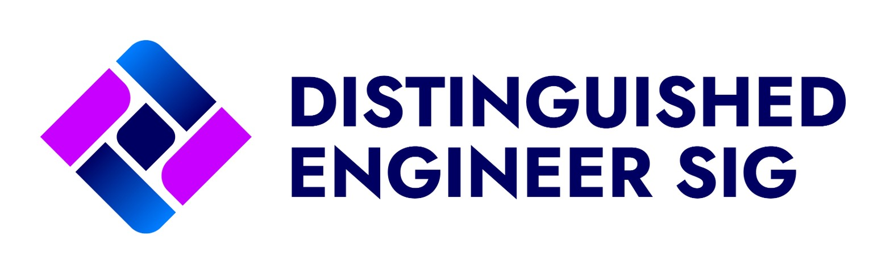

    

# Distinguished Engineer Community (FINOS DE SIG)

> **Mission**  
> *"Our mission is to build a trusted community of distinguished engineers and senior technology leaders that enables cross‑organisational collaboration, amplifies their collective impact on wider society, and champions inclusive and responsible engineering — publishing the results of that collaboration as open, freely reusable resources.*"

---

## Who We Are

We are a **Community of Distinguished Engineers (DEs)** — among the most senior technologists in leading multinational financial institutions. As a **Special Interest Group (SIG)** within the [Fintech Open Source Foundation (FINOS)](https://finos.org), we provide a neutral, open space for DEs from competing firms to collaborate, share expertise, and apply their experience for positive societal impact.

Many DEs spend the majority of their careers focused on internal initiatives and tooling. The DE SIG changes that: by bringing DEs together as a community, we enable them to engage with open‑source initiatives, connect with FINOS ambassadors and projects, and contribute their expertise beyond their own organisations — individually and collectively.

---

## What We Do

The DE SIG has three interconnected purposes:

### 1. Enable Cross‑Organisational Collaboration

Distinguished Engineers face common challenges — in architecture, strategy, talent, and technology adoption — but rarely have a forum to address them together across firm boundaries. The DE SIG provides that forum. We collaborate to:

- Share experience and tackle issues that affect our organisations collectively.
- Produce and publish **thought leadership content** — articles, frameworks, and guidance — as open, Creative Commons‑licensed resources that the whole industry can use.
- Engage with **FINOS projects and open‑source initiatives**, including through regular meetups and webinars. FINOS ambassadors and DE SIG members are natural partners: DEs are exactly the people who can carry open‑source insights back into their organisations, influence strategy, and direct colleagues toward relevant projects.
- Support DEs who are newer to open‑source contribution by connecting them with those who have deep experience — so the community raises the whole group's ability to engage.

### 2. Provide Pro‑Bono Technical Outreach

Smaller charities and community organisations often lack access to the calibre of engineering expertise that DEs represent. Large enterprises frequently have volunteering programmes, but rarely deploy their most senior technical talent in them. The DE SIG changes this through the **Outreach Working Group**, which:

- Partners with charities and social impact organisations to conduct technology landscape reviews, provide strategic technical guidance, and enable in‑house teams.
- Operates under established [Terms of Engagement](terms-of-engagement) that protect all parties — the organisation, the DEs, their employers, and FINOS — from liability, while ensuring engagements are conflict‑free and organisation‑led.
- Draws on open‑source tools and frameworks, and encourages contributions back to open‑source communities where appropriate.

### 3. Champion Inclusive Engineering

Diversity issues in technology are most acute at the top of the career ladder — precisely where DEs sit. The **Inclusive Engineering Working Group** addresses this directly by:

- Mentoring engineers across career stages, prioritising underrepresented groups.
- Developing ethical behavioural design patterns (Nudge Unit) to build inclusivity into engineering processes.
- Delivering education, school outreach, and myth‑busting content to widen the pipeline of future engineers.

This work aligns naturally with open‑source principles: open‑source communities succeed through inclusive governance, consensus‑building, and enabling participation rather than restricting it — values the DE SIG actively promotes.

### DE Role Definition *(completed)*

An earlier working group delivered a [standard definition for the Distinguished Engineer role](docs/DERoleDefinition.md) in Financial Services, providing clarity and consistency for organisations establishing or evolving their own DE programmes.

---

## Why We Work in the Open (and Why FINOS)

Working in the open is intrinsic to our mission:

- **Transparency & trust** — open discussion, public artifacts, and traceable decision‑making.
- **Reusability & impact** — CC BY 4.0–licensed materials can be adopted, remixed, and localised widely.
- **Neutral governance** — multi‑organisation maintainership avoids single‑firm bias, which is essential when members come from competing institutions.
- **Meritocratic participation** — ideas are evaluated on their merits via issues, reviews, and community feedback.
- **Alignment with DE programmes** — DE programmes within large organisations often mirror open‑source and InnerSource principles: enabling the most senior engineers from different teams and franchises to collaborate, share knowledge, and influence strategy. The DE SIG extends this model across firm boundaries.

FINOS provides a neutral home, community infrastructure, and open governance norms that make cross‑firm collaboration at this level possible. FINOS ambassadors embedded in member organisations are a natural bridge between the SIG and the open‑source projects that DEs can influence and contribute to.

---

## How We Operate

**Maintainers (DEs).**  
Distinguished Engineers from multiple organizations act as repository *maintainers* and steward the SIG’s governance, quality, and roadmap.

**Contributors (wider community).**  
We actively welcome contributions from engineers, subject matter experts, professional/engineering practice groups, and anyone with relevant expertise.

**Decision‑making.**  
We use open discussions (GitHub Issues/Discussions) and PR reviews. We prefer **lazy consensus** with documented rationale. Substantial changes use a short design note/RFC via PR.

**Reviews & Approvals.**  
At least **two maintainer approvals** are required for substantial changes. Smaller updates may use a single maintainer approval per policy in CONTRIBUTING.

**Meetings & Cadence.**  
We meet periodically to review progress, triage, and plan. Notes are captured in-repo (e.g., `/meetings/`) and linked from issues.

**Code of Conduct.**  
We follow the FINOS Community Code of Conduct. Be respectful, inclusive, and constructive at all times.

---

## What We Produce (Toolkit)

All outputs are published as open, CC BY 4.0–licensed resources. We are building a public **Toolkit** organised by working group and cross‑cutting themes:

- **Outreach** — terms of engagement templates, technology landscape review frameworks, charity engagement playbooks, anonymised case studies.
- **Inclusive Engineering** — mentor guides, programme templates, inclusive practices, ethical nudge patterns.
- **DE Role Definition** — standard role definition document, competency frameworks, adoption guidance.
- **Thought leadership** — cross‑firm articles, curated reading lists, talks, and conference content.
- **Open‑source engagement** — guides for DEs engaging with open‑source for the first time, FINOS project spotlights, webinar recordings.
- **Practical guidance** — AI usage guardrails, RFP/tender checklists, policy/playbook templates.
- **Education** — slide decks, webinars, short explainer notes, school outreach materials.
- **Research** — summary briefs, methods, collaboration frameworks.

## Contributing

We welcome issues, discussions, and PRs from across the community.  
See [CONTRIBUTING.md](./CONTRIBUTING.md) for details on:

- What to contribute (docs, templates, examples, research notes, talks, case studies)
- Issue‑first workflow and PR process
- Review & approval (maintainers), and lazy consensus
- DCO sign‑off for all commits
- Style guidance for Markdown, diagrams, and images
- Licensing and attribution

> **DCO**: All commits must be signed (`git commit -s`) with a valid `Signed-off-by:` line.

---

## Roadmap

We track the roadmap transparently through issues, milestones, and project boards. See [docs/roadmap.mdx](docs/roadmap.mdx) for the full roadmap.

---

## License

Copyright © 2026 Fintech Open Source Foundation

This work is licensed under a [Creative Commons Attribution 4.0 International License][cc-by].

[![CC BY 4.0][cc-by-image]][cc-by]

[cc-by]: http://creativecommons.org/licenses/by/4.0/
[cc-by-image]: https://i.creativecommons.org/l/by/4.0/88x31.png
[cc-by-shield]: https://img.shields.io/badge/License-CC%20BY%204.0-lightgrey.svg

SPDX-License-Identifier: [CC BY 4.0](https://spdx.org/licenses/CC-BY-4.0.html).
